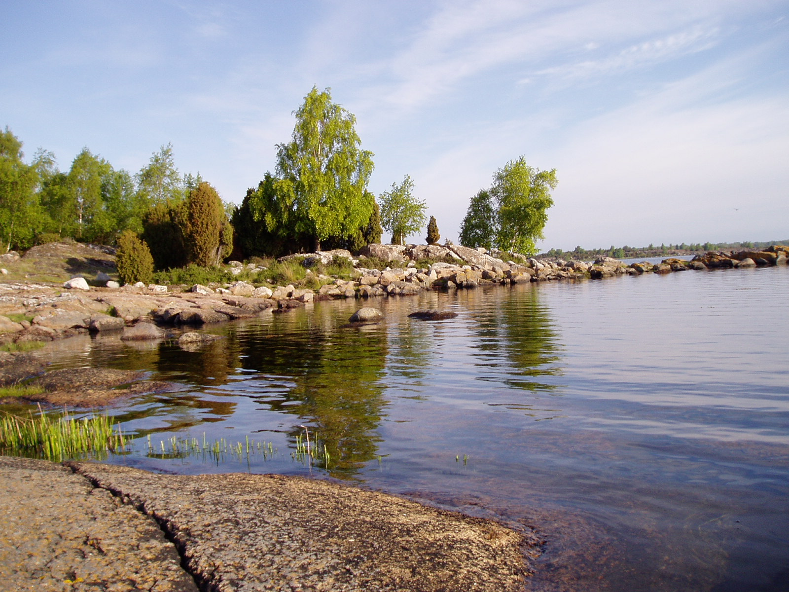

# Karlskrona skærgård
Dette er en lavvandet skærgård og øerne er ikke så høje. De fleste af øerne er ret bebyggede, men der er masser af skønne lejrpladser.

De lave øer giver ikke meget læ for vinden så man kan godt komme ud for kraftig blæst selvom det næppe bliver til de store bølger.

## Kort materiale
Den svenske länsstyrelsen har diverse kort materiale over sverige. 

* De har lavet nogle [kort der er beregnet på at online brug.](http://ext-webbgis.lansstyrelsen.se/sverigeslanskarta/?visibleLayerNames=&zoomLevel=7&x=537774.1250000002&y=6222910.656250003)
* De har også nogle kort der er baseret på Microsoft silverlight. De er af [bedre kvalitet, og er bedre til at printe.](http://ext-webbgis.lansstyrelsen.se/blekinge/lansfakta/)
* Endelig har jeg fra tidernes morgen (omkring 2006) nogle [kort som jeg har brugt meget (i pdf format)](KarlskronaAlla.pdf)

## Brocurer om de enkelte øer
Der er forskelligt materiale om de enkelte øer. Jeg mener at der (per April 2017) er følgende steder der er gode mht. info:

* [Visit Karlskrona](http://www.visitkarlskrona.se/sv/upplev/karlskrona-skargard). Specielt er der et kort over [faciliteterne i skærgården](http://www.affarsverken.se/Global/Skargardstrafik/Karta/Skargardskarta_2016.pdf)
* [Skærgårdens hjemmeside](http://www.skargarden.net/oarna)
* Länsstyrelsen har en lille [tekst om hver af de små naturparker](http://www.lansstyrelsen.se/blekinge/Sv/djur-och-natur/skyddad-natur/naturreservat/Pages/default.aspx) der er. Det er lidt svært at se hvilke der ligger i skærgården. 
* Jeg har samlet et par af de gamle brocurer for nogle af øerne (fra 2010).
	* [Almö](Almo.pdf)
	* [Hästholmen & Ytterön](HastholmenYtteron.pdf)
	* [Järkö](Jarko.pdf)
	* [Knösö](Knoso.pdf)
	* [Torshamns_udde](Torhamns_udde.pdf)

## Lejrpladser
Der er en del muligheder for at slå lejr på øerne i både den østlige og den vestlige ende af skærgården, mens der ikke er gode muligheder på de store øer i midten. 
